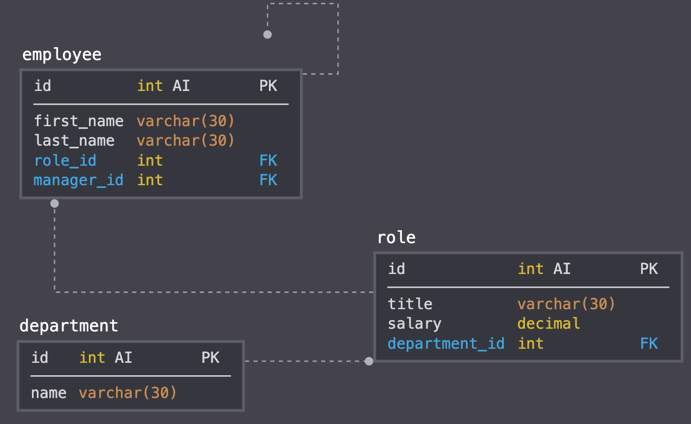

# Employee-Management-System
View and manage the department, roles and employees in your company using this CLI application.

## Table of Contents

- Aim
- Usage and Instructions
- Technologies Used
- Environment

# Aim

For a business owner, or head of an organization, this application makes it easy to keep track of and update the employees data. The user can view different sets of data and perform various types of operations on the data, so that he can better manage the system. 

# Usage and Instructions

When the application begins, the user is welcomed and is presented with a list of choices of all of the different things to do. Upon choosing one of th options, related further questions will asked in order to gather all the data needed to fulfil the user's request.
The user will be shown an appropriate message on completion of the request. Selecting the QUIT option will end the connection to your database.

###### Command to run

`node EmployeeManager.js`

###### These are the different tables used in this system:



###### The following operations can be performed on the data:

```
            - View all Employees
            - Add Employee
            - Add Role
            - Add Department
            - View Roles
            - View Departments
            - Update Employee Role
            - Delete Employee
            - Delete Role
            - Delete Department
            - Update Employee's Manager
            - View Employees By Manager
            - View Department Budget
            - QUIT

```

# Technologies Used

- Node JS
- Mysql Workbench
- inquirer
- Other npms for enhancing display: console.table, figlet, boxen

# Environment

Install `inquirer` , `mysql`, `console.table`, `figlet`, and `boxen` package to utilize this application.
Run the `EmployeeManager.js` file.


